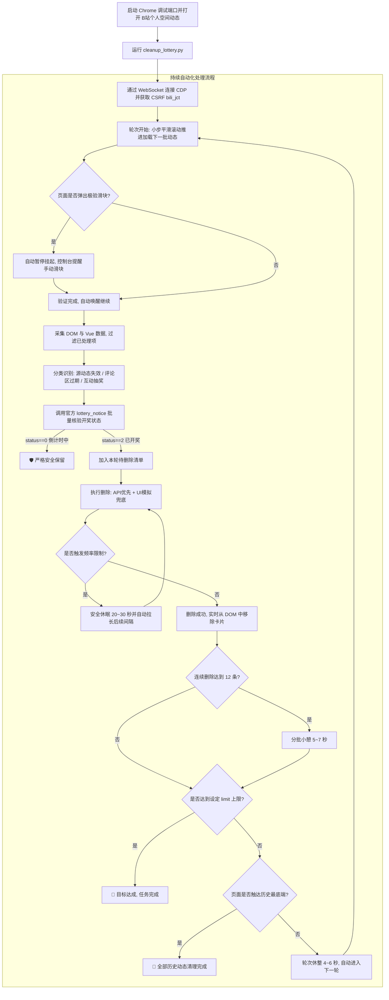

# Bilibili 过期抽奖转发动态清理器 (Bilibili Dynamic Lottery Cleanup)

[](https://www.python.org/)
[](LICENSE)
[]()
[]()

🚀 **专为清理 B 站个人空间历史抽奖转发动态打造的全自动、高精度清理工具。**

本项目通过 **Chrome CDP (Chrome DevTools Protocol)** 远程调试协议与 **B 站官方 API** 协同工作，无需手动配置账号密码或保存 Cookie，直接复用本地 Chrome 浏览器中已登录的状态。支持全自动持续分批扫描、多重条件精准识别、防风控节奏控制与安全批量删除，直至个人历史动态底端。

---

## 🌟 核心特性

- 🎯 **三大分类精准识别**：
  - **源动态失效**：精准检测「源动态已被作者删除」与「源动态不可见」的转发。
  - **评论区/正文抽奖**：通过智能正则提取文本中的开奖日期，自动比对系统时间判断是否过期。
  - **官方互动抽奖**：高效批量核验官方开奖状态，已开奖（已公示中奖名单）自动纳入清理队列。
- 🛡️ **严格安全保留机制**：
  - **未开奖绝对保护**：对于仍在倒计时中的进行中抽奖活动，100% 严格保留，绝不误删。
  - **原创动态保护**：仅处理转发类型动态，个人发布的原创图文、视频动态一律安全保留。
- 🔄 **全自动持续流水线**：
  - 采用流式处理架构：「小步平滑推进加载 $\to$ 增量识别 $\to$ 防风控删除 $\to$ 轮次休整 $\to$ 自动下一轮」。
  - 无需人工反复翻页或重复启动，自动持续向下清理直至历史最底端（出现「没有更多动态了」）。
- ⏳ **智能防风控与人机保护 (Anti-Bot)**：
  - **拟人化微扰动 (Jitter)**：滚动步长与操作间隔均引入随机时间浮动，消除机械化定时特征。
  - **分级节奏休整**：支持单条间隔、分批小憩与轮次休整，有效平抑接口访问频次。
  - **自适应降频与冷却**：若捕获到 B 站操作频繁或限速提示，自动休眠冷却并动态拉长间隔，原位自动重试。
  - **验证码感知挂起**：自动监测页面是否出现极验滑块，出现时自动暂停并提醒人工处理，验证通过后无缝恢复。
- ⚡ **双模删除与 DOM 轻量化**：
  - 默认优先调用官方 API 极速删除，遇到异常自动无缝降级为 CDP 模拟鼠标真实点击。
  - 删除成功的卡片实时从页面 DOM 移除，避免页面长时间运行积累成百上千条卡片造成浏览器卡顿或内存膨胀。

---

## 📊 方案特性对比

| 功能特性 | 常见油猴脚本 (如 bilibili-dynamic-del) | 纯 UI 模拟点击方案 | **本项目 (cleanup_lottery.py)** |
| :--- | :--- | :--- | :--- |
| **持续无人值守** | ❌ 需人工持续翻页或容易中断 | ❌ 速度慢，难以长时间运行 | **✅ 持续流式流水线，全自动处理直至触底** |
| **条件一：源动态被删/不可见** | ❌ 新版接口结构调整后易失效 | ✅ 可识别但处理慢 | **✅ 基于 DOM 特征精准比对，稳定可靠** |
| **条件二：评论区/文本抽奖** | ❌ 未支持日期推算 | ⚠️ 部分支持 | **✅ 正则提取开奖日期，与当前时间比对** |
| **条件三：官方互动抽奖** | ✅ 接口查询快但缺少降级兜底 | ❌ 逐条展开弹窗核验极慢 | **✅ 批量并发核验 + CDP 模拟兜底 + 内存状态缓存** |
| **未开奖动态严格保护** | ⚠️ 依赖单一字段容易误伤 | ⚠️ 易受正文说明文字误导 | **✅ 严格校验 status=0 与倒计时，绝不误删** |
| **防风控与人机保护** | ❌ 高频并发易触发频繁与滑块 | ⚠️ 速度虽慢但时序机械 | **🛡️ 随机微扰(Jitter) + 分批休整 + 自适应熔断降频** |
| **滑块验证码处理** | ❌ 触发后脚本中断报错 | ❌ 弹窗遮挡导致后续点击失败 | **✅ 自动感知并挂起，人工通过后自动继续** |
| **删除执行速度** | 0.1 秒/条 (易被服务端限速) | 2.5 ~ 3.5 秒/条 (过慢) | **⚡ 1.5 ~ 2.1 秒/条 (安全稳健平衡，API优先 + UI兜底)** |
| **登录与凭据安全** | 需在浏览器注入外部脚本 | 需手动提取并暴露 Cookie | **🛡️ 本地原生 CDP 调试通信，零凭据外泄** |

---

## 🎯 识别与删除条件详述

1. **条件一：源动态已被作者删除 / 源动态不可见**
   - 转发的原动态已被原作者删除、注销或设为隐私状态，动态卡片显示「源动态已被作者删除」或「源动态不可见」。
2. **条件二：评论区 / 正文抽奖已过期**
   - 未使用官方互动抽奖工具，而是在正文或评论中说明开奖日期的动态。
   - 脚本通过智能正则表达式提取开奖截止日期（支持年月日及月日格式），若截止时间早于当前时间，则判定为已过期。
3. **条件三：官方互动抽奖已开奖**
   - 包含官方 `互动抽奖` 标签的动态，调用官方抽奖接口批量查询。
   - 活动状态为 `已开奖`（已有中奖名单）则标记删除；活动状态为 `未开奖`（仍在倒计时阶段）**一律安全保留**。

---

## 🛠️ 环境准备与快速上手

### 1. 安装依赖环境
本项目基于 Python 3.8+ 开发，所需依赖库：
```bash
pip install requests websockets
```

### 2. 启动 Chrome 远程调试端口
脚本通过 Chrome 原生 CDP 协议与浏览器通信。请在终端执行以下命令启动调试浏览器（建议指定独立的 `user-data-dir` 以免与正在运行的 Chrome 冲突）：

#### Windows (PowerShell / CMD):
```powershell
& "C:\Program Files\Google\Chrome\Application\chrome.exe" --remote-debugging-port=9222 --user-data-dir="C:\ChromeDebug"
```

#### macOS:
```bash
/Applications/Google\ Chrome.app/Contents/MacOS/Google\ Chrome --remote-debugging-port=9222 --user-data-dir="/tmp/ChromeDebug"
```

#### Linux:
```bash
google-chrome --remote-debugging-port=9222 --user-data-dir="/tmp/ChromeDebug"
```

### 3. 打开 B 站个人动态页面
在刚刚启动的 Chrome 窗口中：
1. 登录你的 B 站账号。
2. 访问你的个人空间动态页：`https://space.bilibili.com/<你的UID>/dynamic`

---

## 🚀 使用指南

### 1. 全自动持续清理（默认模式）
自动分批温和推进页面、扫描识别并安全清理过期动态，持续运行直到历史动态最底端（页面显示「没有更多动态了」）：
```bash
python cleanup_lottery.py
```

### 2. 扫描预览模式（推荐首次使用）
仅对动态进行扫描分类，在终端输出待删清单与原因报表，**不执行任何实际删除**：
```bash
python cleanup_lottery.py --scan
```

### 3. 限制清理条数
若只需阶段性清理指定数量（例如只清理前 50 条）：
```bash
python cleanup_lottery.py --limit 50
```

### 4. 仅处理当前页面已渲染内容（不滚动）
跳过自动滚动，仅对当前浏览器窗口中已渲染的动态卡片进行处理：
```bash
python cleanup_lottery.py --no-scroll
```

---

## ⚙️ 完整命令行参数表

| 参数 | 类型 | 默认值 | 参数说明 |
| :--- | :--- | :--- | :--- |
| `--scan` | flag | `False` | 仅扫描分类并展示待删清单，不执行任何实际删除操作 |
| `--limit` | int | `0` | 最大删除条数（默认 `0` 表示不设上限，持续清理直至历史底端） |
| `--no-scroll` | flag | `False` | 跳过向下滚动，仅处理当前页面已加载渲染的卡片 |
| `--scroll-steps` | int | `4` | 每轮推进滚动步数，采用平滑滚动与小步长模拟真人浏览 |
| `--scroll-delay` | float | `2.0` | 每步滚动后的基础等待时间（秒，自带随机浮动微扰） |
| `--delay` | float | `1.5` | 单条删除后的基础间隔时间（秒，自带随机浮动 ~1.7~2.1 秒） |
| `--batch-size` | int | `12` | 每连续删除 N 条后自动进入分批小憩，平抑高频访问 |
| `--batch-rest` | float | `5.0` | 分批小憩冷却等待时间（秒） |
| `--pass-rest` | float | `4.0` | 每轮批次清理完毕后的轮次休整时间（秒） |
| `--port` | int | `9222` | Chrome 远程调试端口 |

---

## 🛡️ 防风控与人机保护体系

为保障账号安全并避免触发平台访问频率限制（如 HTTP 412、返回“操作过于频繁”或弹出滑块验证码），本项目内置了多层防护措施：

1. **行为拟人化与随机微扰 (Jitter)**：
   - 滚动操作使用 `window.scrollBy({ behavior: 'smooth' })`，单次步长在 1000~1400px 间随机选取。
   - 滚动等待和删除间隔均叠加了随机浮动时间，打破固定定时器的机械行为特征。
2. **多层节奏休整**：
   - 单条删除间隔保持在 1.5s ~ 2.1s 的安全区间。
   - 每删除 12 条动态自动小憩 5~7 秒；每轮批次处理结束后再休整 4~6 秒，留出滑动窗口计数衰减时间。
3. **自适应熔断冷却降频**：
   - 遇到频控响应（如 `-412`、`4101140` 等）时，脚本不会报错退出，而是自动进入 20~30 秒深度冷却休眠。
   - 冷却后自适应调高后续删除基础延时（+0.3s），并原位重试未成功的条目。
4. **极验验证码监测挂起**：
   - 运行中持续监测页面 DOM 是否存在验证码滑块。若检测到滑块弹出，脚本自动暂停并在控制台提示用户前往浏览器手动完成拼图；验证完成后自动唤醒继续执行。
5. **DOM 轻量化与内存缓存**：
   - 删除成功的卡片即时从 DOM 结构中移除，避免长期运行卡片过多导致浏览器卡顿。
   - 内存维护已处理动态与抽奖状态缓存池，避免对相同内容产生重复的网络请求。

---

## 🏗️ 运行流程架构



---

## ❓ 常见问题 (FAQ)

### Q1: 脚本会不会误删我的原创动态或尚未开奖的抽奖？
**绝对不会。**
- **原创动态**：脚本只处理类型为 `DYNAMIC_TYPE_FORWARD`（转发动态）的卡片，所有原创动态一律保留。
- **未开奖抽奖**：官方互动抽奖严格校验 `status == 0`（倒计时中），只要尚未到开奖时刻，脚本 100% 保护跳过。

### Q2: 脚本是否需要人工盯着或者一直手动按键？
**不需要。** 脚本采用持续流式循环设计，从当前位置开始自动分批滚动、识别、删除并休整，直到整个动态历史全部触底或达到设定的条数上限，全程全自动执行。

### Q3: 为什么选择 Chrome CDP 方式而不是直接模拟 HTTP 请求？
B 站的动态加载与删除接口依赖前端风控指纹（如 WBI 签名、Cookie 及安全环境检测）。通过 CDP 复用正在运行的真实 Chrome 浏览器，环境指纹完全真实合法，不仅免去了手动导出 Cookie 和频繁维护签名的繁琐步骤，而且账号安全性更高。

---

## 📄 开源许可证 (License)

本项目基于 [MIT License](LICENSE) 协议开源。

> **免责声明 (Disclaimer)**：
> 本项目仅供个人进行动态数据管理与技术交流学习使用。请在遵守哔哩哔哩平台相关服务条款的前提下合理使用。作者不对因使用本工具可能产生的任何数据变动或账号风控承担责任。
